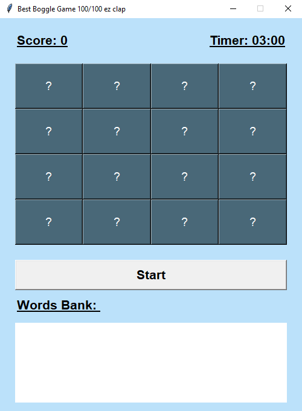
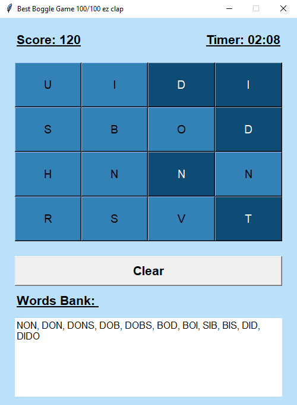

  <h1 align="center" style="border-bottom: none"><b>Exercise 12</b> - Boggle</h1>

  

    <b>Boggle</b> is the 12th and last exercise I've solved in Huji's <b>Introduction to Computer Science</b> course.
     
    Boggle is a board game in which you need to find words in the English Dictionary.
     
    The main idea behind this exercise is to get familiar with <b>GUIs</b> and <b>OOP</b>.
     
    <a href="https://github.com/LielAmar/Introduction-To-CS-solutions"><strong>« Home Page</strong></a>
     
  

 

  <h2 align="left" style="border-bottom: 1px solid gray">Code Structure</h2>

  <ul align="left">
    <li>OOP utilization, including multi-level inheritance and code-abstraction</li>
    <li>Logic and design seperation</li>
    <li>No magic numbers - Constant variables and a constant design pattern</li>
    <li>Fast and efficient utilities</li>
    <li>Both generators and iterators implementations</li>
    <li>Functions that call functions that call functions that call... Okay, you get it. It's recursion.</li>
    <li>Functions that return an inner function</li>
    <li>Great API with on point error raising and handling</li>
    <li>Dynamic bruteforce machanizem for different functions</li>
  </ul>

 

  <h2 align="left" style="border-bottom: 1px solid gray">Features</h2>

  <ul align="left">
    <li>Custom sounds when playing the game (for windows users)</li>
    <li>Random cursor for each button!</li>
    <li>An option to clear your current selection in an instant!</li>
    <li>Only want to clear to some point? No worries, we got you! All you need to do is to press the button you want to clear up to</li>
    <li>Dynamic action button</li>
    <li>Dynamic word bank</li>
  </ul>

 

  <h2 align="left" style="border-bottom: 1px solid gray">Usage</h2>

  <ol align="left">
    <li>You can run the project on your personal machine by cloning this repository using <code>git clone &lt;url&gt;</code></li>
    <li>Open the cloned project in your IDE</li>
    <li><i>(Optional)</i> Create a virtual environment using <code>python3 -m venv venv</code></li>
    <li>Use <code>pip install -r requirements.txt</code> to install all required libraries</li>
    <li>run <code>python3 &lt;python file&gt;</code> to run the project</li>
  </ol>

 

  <h2 align="left" style="border-bottom: 1px solid gray">Media</h2>

  

    
     
    
  

 

  <h2 align="left" style="border-bottom: 1px solid gray">Contributing</h2>

  

    Pull requests are welcome. For major changes, please open an issue first to discuss what you would like to change.
  

 

  <h2 align="left" style="border-bottom: 1px solid gray">License</h2>

  

    <a href="https://choosealicense.com/licenses/mit/">Licensed under MIT</a>
  

